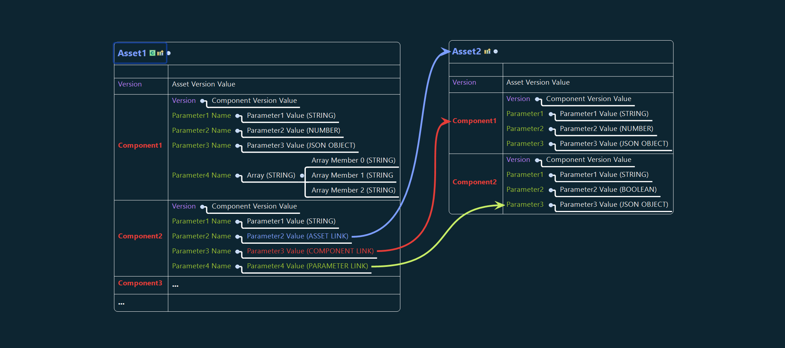
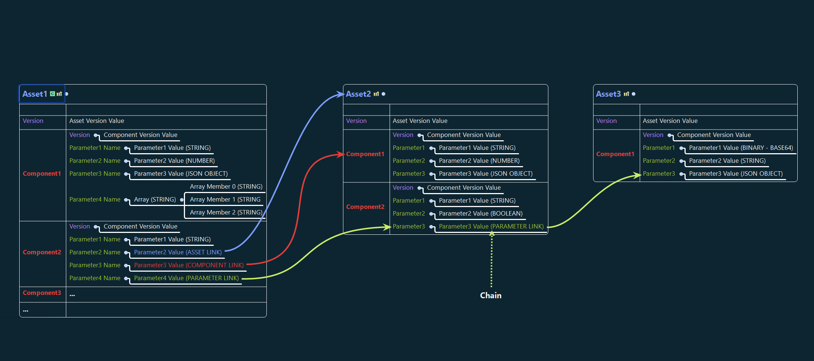
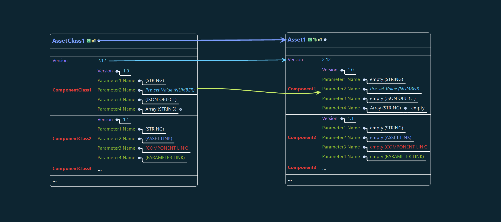

# 03. System Architecture

## 3.1 Asset Architecture

&#x20;  **3.1.1 Parameter Linking**

<figure><figcaption>
Fig. 3.1.1 - Parameter Linking
</figcaption></figure>

&#x20;  **3.1.2 Parameter Chaining**

<figure><figcaption>
Fig 3.1.2 Parameter Chaining
</figcaption></figure>

&#x20;  **3.1.3 Asset Instancing**

<figure><figcaption>
Fig 3.1.3 Asset instancing from an AssetClass
</figcaption></figure>
